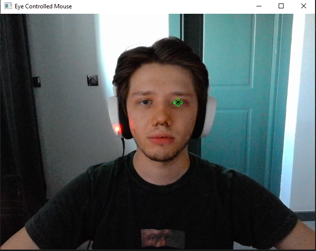
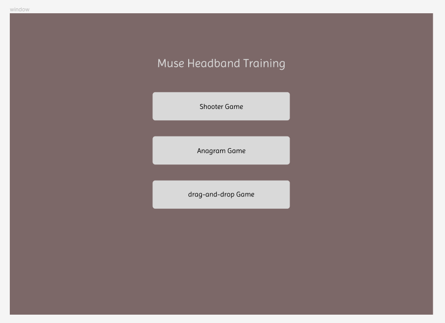

18/08/2023
i have found this documentation about mediapipe https://developers.google.com/mediapipe/solutions/vision/face_detector#get_started that i find it is quite interesting and shows quite a lot of other things that can be maybe used in the future of the project.
i have also saw the OpenCV documentation https://docs.opencv.org/4.x/ where all of the methods are explained into detail. i find it interesting that the cv2.cvtColor(frame, cv2.COLOR_BGR2RGB) method interesting aperantly it is converting the existing view into another color space, and there is quite a bit of color spaces available. in this case the color space is RGB
did some testing where it shows if a face is detected or not. when the face is not shown the input terminal will print "none" and if there is a face the coordinates of the center of the face is shown.

19/08/2023(morning)
the face detector was detecting multiple faces now it only detects one face this was done by landmark_points[0].landmark. the x, y and z coordinates of the landmark on the screen, x is the width and y is the height, z is the distance from the camera but what we are interested in is the x and y coordinates only since the work we need only requires 2 dimentional space. as i only require to get the x and y dimentions. i realized that the outputs are shown between 0 and 1 (example: 0.827323317527771 0.6220095753669739) so to get the pixel values of this i am multiplying the x and y value with the frame_weight and frame_height which were gathered by frame.shape that is provided by OpenCV. the number however is in float so to turn this float, to be able to create the face circle we require to turn these float numbers into integer values. these integer values are later used in an OpenCV method (cv2.circle) to detect all the landmarks on the face, these are the parameters that cv2.circle takes so it is easier to understand cv2.circle(image, center_coordinates, radius, color, thickness). in our scenario the image we get is the frame, the center coordinates have already been found in the previous step which were (x,y) and the radius is shown as 3px since it cannot be too small or too big of circles (thickness was not used as in it made the circles to thick which comes in front of facial recognition.). here are the end results  
however i still require to track the eye movement

19/08/2023(night)
after some research on https://github.com/google/mediapipe/blob/master/docs/solutions/face_mesh.md#refine_landmarks i have learned about the refine_landmarks functionality which helps refine the coordinates around the eyes or the lips. the FaceMesh model overal puts 478 3-dimensional face landmarks(CITATION https://developers.google.com/mediapipe/solutions/vision/face_landmarker/) and since we need out of all these landmarks only the iris we only get ranging from 478 to 468 shown in code as: landmarks[474:478]. the issue right now is that the camera view shows the opposite, so to fix this i have flipped the frame by using OpenCV cv2.flip(frame, 1) method to flip camera view vertically. this is what it looks like atm S

20/08/2023
the next step is to make the cursor move with the detected eye. but issue is that there are 4 landmark circles on the eye and if each one of them tries to move the cursor it causes less accuracy so i have been testing it with only getting one landmark where the landmarks[473:474] , or maybe an enumeration can be added with id numbers given to each of these landmarks and make the pyautogui follow only one of them. speaking of which the PyAutoGUI documentation (https://pyautogui.readthedocs.io/en/latest/) is quite helpful and helped me find the method pyautogui.moveTo(x, y) which is used to make the cursor move with head movements. however the main issue now is that the frame is smaller compared to the screen, to fix it we scale the frame a little bigger. the way how i scaled the frame was by these 2 lines "screen_x = int(landmark.x * screen_width)" and "screen_y = int(landmark.y * screen_height)" (multiplying the coordinates of the landmark by the screensize shows which pixel the cursor needs to be at so the cursor moves to the given coordinates) TESTING FOR THIS IS DONE BY THIS LINE OF CODE print((landmark.x * screen_width), (landmark.y * screen_height)) which displays the pixel where the cursor is at.
MY BIG CONCERN IS I DONT KNOW IF THIS WOULD BE UNIT TESTABLE ???? ASK LELA

20/08/2023
now that we have a cursor that tracks our eye movement i can start on the game itself, what i have in mind for the game is a birds eye view shooter game where the user sees the character from a top down view. i am creating the game on unity but as i am writing this i am having some issues with git, maybe i might have to create a new repo for the game.

25/08/2023
i have finsihed the basics of the game and have been researching how to get the data that is created in this python script in to Unity. i made quite a lot of research and saw few third party tools such as ironPython and Python For Unity. However i realised that ironPython is outdated and no longer used, while the Python for Unity does not support the Python versions above 2.7.(the python version we use is 3.9), so i saw some people online that sends the data from the python script through a TCP socket to the Unity2D's C# script. today i will mostly test on this, hopefully it works the way i wish.

31/08/2023
i have created the Apps main menu where all the tutorial games are presented, however this is the first designs, it might change in the future. here is the low fidelity design here is the high fidelity design made in figma: . the menu menu is created by using Tkinter library, this library provides me the tools to create a well made GUI. however i have found another plugin for this app which is called Tkinter-designer. i just create the design on figma and this will automatically create the gui app for me. however i would require to use their tools on the github they have provided. here is their github: https://github.com/ParthJadhav/Tkinter-Designer.git . now i will add more things on top of this gui.
i have managed to create the connection between the different pages with tkinter. however i came to realisation that the method i created creates new windows over and over again making it look not too professional. so what i have decided to do is to use Frame. Frame is a tkinter widget that only takes up a certain space on the window, and the contents of its can be easily manipulated, my main idea is to set up the page to few different frames and change them as i go but still i require some more testing on this.

what we require is that we have one main page where we have the game options, after a game is chosen  it will show the tutorial to that game and after it is clicked to the page user will be take to the game, where they can play the game they wanted to play. maybe i could add second page the frames, and only on the tutorial pages we use frames. and later when after where the game will work we could direct to another window?

01/09/2023
i have a simple gui for the app and currently i do have the eye tracker and the gui app. which is required to be running at the same time. to run these both at the same time there is a python library called threading that helps me do multithreading. after few hours i have managed to make the multithreading work. now when i run the application the gui pops up and the eye_movement_tracker starts following the movement of my eyes. at the moment i only have one of the games created which is the shooter game, and i have also managed to run the shooter game with the OS library, where i just classify the path of the game, and execute it with the inbuilt method os.startfile("path") (the path needs to be accurate, when setting up the files, this might require some change according to device but at the end all of this would be in one folder where it is easier to access and same for all devices), however this method is called later when a random click is made to the window, here is how the second window looks like: . today i will create a through backlog and share it here.